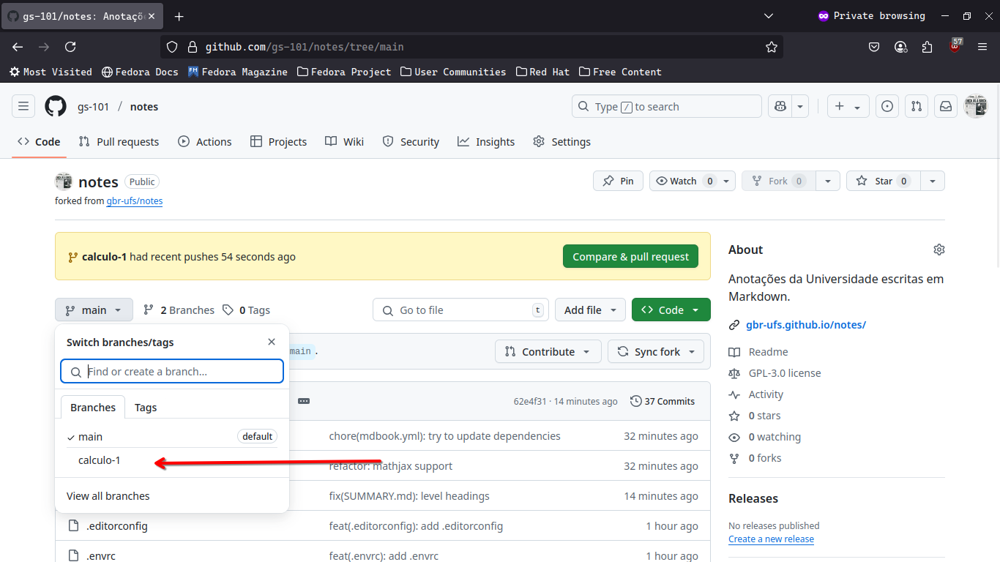
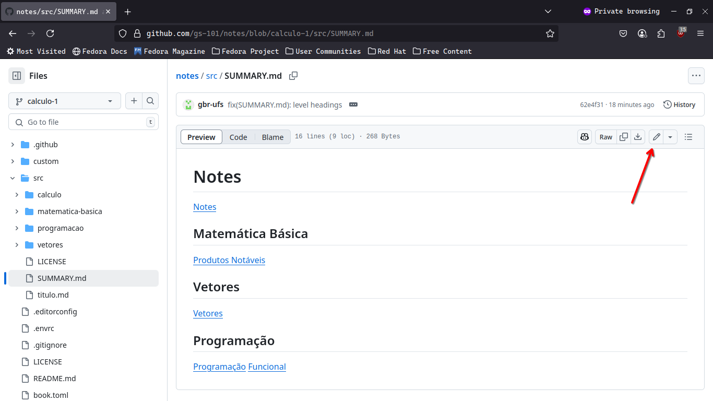

# Criando um novo arquivo

## Crie Um *Fork* (cópia, clone) do Repositório

## Crie Um *Branch* ("galho", variação) do Principal

Primeira seta: botão com *main* no nome.
Segunda seta: botão que diz "mostrar todos os *branches*" ou algo parecido.

### Mudando de *Branches*

Isso é importante pois ajuda a deixar as suas mudanças organizadas.

## (Finalmente) Criando um Novo Arquivo

### Aba do Arquivo

A primeira coisa que você deve fazer é dar um nome. Os arquivos ficam guardados na pasta `src` (*source*, *fonte*), então comece o nome com `src/` para mudar a pasta. Nomes serão escritos `desse-jeito-aqui-o-sem-assento.md`. O `.md` é porque o arquivo deverá ser escrito em [Markdown](https://docs.github.com/pt/get-started/writing-on-github/getting-started-with-writing-and-formatting-on-github/basic-writing-and-formatting-syntax).

.

#### *Commit* (fazer mudanças)

*Commit* é quando salvamos uma modificação que fizemos pelo `git`, que é o programa que o GitHub usa para salvar as coisas.

## *Pull Request* (pedir que suas alterações sejam adicionadas)

O GitHub, e outros serviços parecidos, usam seu próprio esquema para juntar as mudanças de vários usuários, a *pull request* (o original, na marra, é mandar as mudanças por e-mail).

## Conclusão

Pronto! Seu pedido para inclusão foi feito

# Editando um Arquivo Existente

## Conclusão

De resto, siga as instruções a partir do tópico *Commit*.
