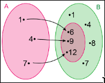

# Funções

Tradicionalmente, é uma regra que liga um número (*argumento*) a outro (*valor*). É usado na ciência para descrever processsos onde uma quantidade afeta outra.

Uma **função** \\( f \\) de um conjunto \\( X\\) em um conjunto \\( Y \\) é uma relação que associa cada elemento \\( x \in X \\) a um único elemento \\( y \in Y \\) que denotamos por \\( y = f(x) \\). Assim, uma função \\( f : X \rightarrow Y \\) satisfaz duas condições:

(1) \\( D(f) = X \\)

(2) \\( (x, y) \in f \land (x, z) \in f \implies y = z \\)

Aqui \\( D(f) \\) é dito o **domínio** da função \\( f \\) e o conjunto de \\( Y \\) dado por

\\[
f(X) = I(f) = \\{f(x): x \in X\\}
\\]

é chamado **imagem** de \\( f \\). Designamos o conjunto \\( Y \\) como o **contra-domínio**.

Para ser uma função, todo elemento do conjunto \\( X \\) deve estar associado a outro do conjunto \\( Y \\), mas a inversa não precisa ser necessariamente verdade.

## Exemplo

(1) A função \\( f : A = \\{1, 4, 7\\} \rightarrow B = \\{1, 2, 6, 7, 8, 9, 12\\} \\) dada por \\( f(x) = x + 5 \\) pode ser representada por um diagrama de flechas. Note que \\( I(f) = \\{6, 9, 12\\} \subset B \\).

(2) Muitas vezes, funções são dadas sem haver menção ao domínio. Nesse caso, o domínio é entendido como o maior subconjunto de \\( \mathbb{R} \\) para o qual \\( f \\) está definida. Por exemplo, para \\( f(x) = \frac{\sqrt{x}}{x - 2} \\), o domínio de \\( f \\) é \\( [0, \infty) - \\{2\\} = D(f) \\).

## Definição

Duas funções \\( f : A \rightarrow B \\) e \\( g : C \rightarrow D \\) são iguais se, e somente se, \\( A = C, B = D \land \forall x \in A = C, f(x) = g(x) \\).

## Exemplo

Consideremos as seguintes funções \\( f : \mathbb{R} \rightarrow \mathbb{R} \\) e \\( g : \mathbb{R}\_{+} \rightarrow \mathbb{R} \\) dadas por \\( f(x) = x^{3} \\) e \\( g(x) = x^{3} \\), respectivamente. Então, mesmo tendo expressões iguais, como \\( \mathbb{R} \neq \mathbb{R}_{+} \\), elas são diferentes.

## Combinando funções

Quando o contradomínio das funções são conjuntos em que se podem fazer operações aritméticas, então podemos produzir novas funções a partir de funções dadas combinando-as. Desse modo, se \\( A \\) é um conjunto qualquer e \\(f, g : A \rightarrow \mathbb{R} \\), definimos as seguintes novas funções \\( f + g \\), \\( f - g \\), \\( f \cdot g \\) e \\( \frac{f}{g} \\) de \\( A \\) em \\( \mathbb{R} \\) através dos valores de \\( f \\) e  \\( g \\) em cada \\( x \in A \\). Isto é

- \\( (f + g)(x) = f(x) + g(x) \\)
- \\( (f - g)(x) = f(x) - g(x) \\)
- \\( (f \cdot g)(x) = f(x) \cdot g(x) \\)
- \\( (\frac{f}{g})(x) = \frac{f(x)}{g(x)} (g(x) \neq 0) \\)

### Exemplo

Seja \\( f(x) = x^{2} + 1 \\) e \\( g(x) = 2x + 1 \\), temos as seguintes funções:

- \\( (f + g)(x) = x^{2} + 2x + 2 \\)
- \\( (f - g)(x) = x^{2} - 2x \\)
- \\( (f \cdot g)(x) = 2x^{3} + x^{2} + 2x + 1\\)
- \\( (\frac{f}{g})(x) = \frac{(x^{2} + 1)}{(2x + 1)} (x \neq \frac{1}{2}) \\)

### Restrição

Outra maneira de a partir de uma função \\( f : X \rightarrow Y \\) se obter uma nova função é restringir a ação da função a um subconjunto de seu domínio ou, ao contrário, estender o domínio.

(1) se \\( a \subset X \\), a função \\( f|\_{A} : A \rightarrow Y \\) definida por \\( f|_{A}(a) = f(a), \forall a \in A \\) é dita a **restrição** de \\( f \\) ao conjunto \\( A \\).

(2) se \\( X \subset W \\) uma função \\( g: W \rightarrow B, g(x) = f(x) \forall x \in X \\) é dita uma **extensão** de \\( f \\).

### Exemplo

A função \\( f : (0, \infty) \rightarrow \mathbb{R}, f(x) = \frac{1}{x} \\) cresce ilimitadamente quando nos aproximamos de \\( x = 0 \\), porém, sua restrição \\( g : [\frac{1}{2}, \infty) \rightarrow \mathbb{R}, g(x) = \frac{1}{x} \\) é limitada, com \\( g(x) \leq 2, \forall x \in [\frac{1}{2}, \infty) \\).

### Exemplo

A função raiz quadrada pode ser estendida para todo o conjunto dos reais através da função \\( g : \mathbb{R} \rightarrow \mathbb{R}, g(x) = \sqrt{|x|} \\).

## Composição e funções inversas

Desde que cada função é uma relação e cada relação possui associado a ela sua inversa, isto é, se \\( f : A \rightarrow B \\) é uma relação, então a relação inversa \\( f^{-1} \\) é dada por

\\[
f^{-1} = \\{(y, x) : (x, y) \in f\\}
\\]

diremos que \\( f \\) é **invertível** se \\( f^{-1} \\) é também uma função.

### Exemplo

Para a função \\( f = \\{(x, y) : y = 2x + 1\\} \subset \mathbb{R} \times \mathbb{R} \\), a inversa de \\( f \\) é a função

\\[
f^{-1} = \\{(y, x) : (x, y) \in f\\} = \\{(y, x) : y = 2x + 1\\} = \\{(y, x) : x = \frac{y - 1}{2}\\}
\\]

Contudo, para a função \\( g = \\{(x, y) : y = x^{2}\\} \subset \mathbb{R}^{+} \times \mathbb{R}^{+} \\), temos que a relação inversa

\\[
g^{-1} = \\{(y, x) : (x, y) \in g\\} = \\{(y, x) : y = x^{2}\\} = \\{(y, x) : x = \pm \sqrt{y}\\}
\\]

não é uma função. De fato, \\( (1, 1), (1, -1) \in g^{-1} \\) pois \\( 1^{2} = (-1)^{2} \\). Porém, \\( 1 \neq -1 \\).

(1) Elementos distintos no domínio \\( A \\) devem estar associados a elementos distintos no contradomínio \\( B \\), ou seja, se \\( x \neq y \in A \\), então \\( f(x) \neq f(y) \in B \\). Funções que satisfazm esta propriedade são chamadas de **funções injetivas**.

(2) Cada elemento no contradomínio \\( B \\) deve ser imagem sob \\( f \\) de pelo menos um elemento de \\( A \\). Em outras palavras \\( \forall y \in B,  \exists x \in A, f(x) = y \\), ou ainda, \\( I(f) = B \\). Funções que satisfazem esta propriedade são ditas **funções sobrejetivas**.

Desse modo, se a função \\( f \\) não for **bijetiva**: injetiva e sobrejetiva, ela não é invertível. Noutras palavras, se \\( f \\) é invertível, necessariamente ela é bijetiva.

### Exemplo

Seja \\( f : \mathbb{R} \times \mathbb{R} \rightarrow \mathbb{R} \times \mathbb{R} \\) definida por \\( f(x, y) = (-x + y, x + y) \\). Se \\( (x, y), (z, t) \in \mathbb{R} \times \mathbb{R} \\) são tais que \\( f(x, y) = f(z, t) \\), então

\\[
(-x + y, x + y) = (-z + t, z + t)
\\]

Isto implica que

\\[
-x + y = -z + t \implies x + y = z + t
\\]

Somando esssas identidades, obtemos que \\( y = t \\) e, consequentemente, \\( x = z \\). Assim, \\( (x, y) = (z, t) \\) e a função \\( f \\) é injetiva. Agora, para verificarmos se a função \\( f \\) é sobrejetiva, tomemos um elemento genérico \\( (c, d) \\) em \\( \mathbb{R} \times \mathbb{R} \\) e busquemos um elemento no domínio \\( (x, y) \in \mathbb{R} \times \mathbb{R}, f(x, y) = (c, d) \\). Por definição de \\( f \\), temos que \\( (-x + y, x + y) = (c, d) \\), donde \\( -x + y = c \land x + y = d \\). Somando essas equações obtemos que \\( y = \frac{c + d}{2} \\). Substitutindo em uma das equações acima, concluímos que \\( x = \frac{d - c}{2} \\). Portanto,

\\[
f\left(\frac{c + d}{2}, \frac{d - c}{2}\right) = (c, d)
\\]

e a função \\( f \\) é sobrejetiva. Desse modo, \\( f \\) é uma função bijetiva.

### Composição

Seja \\( f : A \rightarrow B \\) e \\( g : B \rightarrow C \\). A **composição** de \\( g \\) e \\( f \\) é a relação

\\[
g \circ f = \\{(x, y) : \forall y \in B, (x,  y) \in f \land (y, z) \in g\\}
= \\{(x, z) : \exists y \in B, f(x) = y \land g(y) = z\\}
= \\{(x, z) : g(f(x)) = z\\}
\\]

Logo, \\( g \circ f : A \rightarrow C \\) será definida por \\( (g \circ f)(x) = g(f(x)) \\).

#### Exemplo

Seja \\( f(x) = sen(x) \\) e \\( g(x) = x^{2} + 6x \\).

\\[
(f \circ g)(x) = f(g(x)) = sen(g(x)) = sen(x^{2} + 6x)
\\]

e

\\[
(g \circ f)(x) = g(f(x)) = sen^{2}(x) + 6sen(x)
\\]

Como a operação de composição de funções não é comutativa, \\( f \circ g \\) pode ser diferente de \\( g \circ f \\).

#### Observação

Como a composição de relações é associativa e funções são relações, a composição de funções também é associativa, ou seja, \\( f : A \rightarrow B, g : B \rightarrow C \land h : C \rightarrow \implies (h \circ f) \circ g = h \circ (f \circ g) \\).

### Definição

Se uma função \\( f : A \rightarrow B \\) é bijetiva, então ela é invertível.
