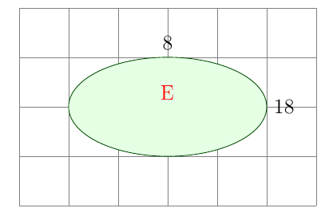

# Relações

## Definição

Sejam \\( A \\) e \\( B \\) conjuntos. Uma **relação** \\( R \\) entre \\( A \\) e \\( B \\) é um subconjunto de \\( A \times B \\). Assim, se \\( (a, b) \in R \\), escrevemos \\( aRb \\) (ou \\( a ~ b \\)) par aexpressar que \\( a \\) e \\( b \\) estão relacionados. O **domínio** de uma relação é o conjunto \\( D(r) = \\{x \in A : \exists y  \in B \text{ tal que } xRy\\} \\) e a **imagem** da relação é o conjunto \\( I(R) = \\{y \in B : \exists x \in A \text{ tal que } xRy\\} \\).

## Exemplo

Seja \\( A = \\{1, 2, 3\\} \\) e \\( B = \\{2, 3, 4\\} \\). Defina a relação \\( R = \\{(x, y) : x + 1 < y\\} \\).

### Resolução

\\[
R = \\{(1, 3), (1, 4), (2, 4)\\}
\\]

\\[
D(R) = \\{1, 2\\}
\\]

\\[
I(R) = \\{3, 4\\}
\\]

O domínio fica na esquerda e a imagem na direita.

## Exemplo

(1) Sobre \\( \mathbb{Z} \\) consideremos a relação \\( R = \\{(x, y) \in \mathbb{Z} \times \mathbb{Z} : x + y = 0\\} \\). Enstão \\( R = \\{..., (-1, 1), (1, -1), (0, 0), (2, -2), ...\\} \\) é o conjunto de pontos sobre a reta dada pela equação \\( y = -x \\) com coordenadas inteiras.

(2) Sobre o conjunto \\( \mathbb{N} \times \mathbb{N} \\) considere a relação \\( (m, n)R(s, r) \iff m + r = n + s \\). Esta relação possui uma infinidade de elementos. Por exemplo, \\( (1, 1)R(2, 2), (1, 3)R(5, 7), ...\\).

(3) Seja \\( E = \\{(x, y) \in \mathbb{R} \times \mathbb{R} : \frac{x^{2}}{324} + \frac{y^{2}}{64} \leq 1\\} \\). O gráfico de \\( E \\) é constituído pelos pontos do plano que estão dentro e sobre a elipse.

(4, 5) Relações também podem ser representadas usando grafos e fluxogramas.

## Definição

SE \\( R \\) é uma relação entre os conjuntos \\( A \\) e \\( B \\), então definimos a **inversa** de \\( R \\), denotada por \\( R^{-1} \\), como sendo a relação

\\[
R^{-1} = \\{(x, y) \in B \times A : (x, y) \in R\\}
\\]

## Exemplo

(1) No caso da relação \\( R = \\{(x, y) : x + 1 < y\\} \\) em \\( A \times B \\), sua inversa é dada pela relação \\( R^{-1} = \\{(3, 1), (4, 1), (4, 2)\\} \\) em \\( B \times A \\). Ou seja, os papéis de \\( x \\) e \\( y \\) foram trocados; enquanto em \\( R \\) o critério era que o segundo componente do par ordenado fosse maior que o primeiro mais uma unidade, em \\( R^{-1} \\) o primeiro componente é que é maior que o segundo mais uma unidade.

(2) Seja \\( R \\) uma relação sobre o conjunto dos números reais \\( \mathbb{R} \\) definida por \\( xRy \iff y = x^{2} \\). Determine \\( R^{-1} \\).

Recorrendo à definição de relação inversa, temos que

\\[
R^{-1} = \\{(y, x) \in \mathbb{R}^{+} \times \mathbb{R} : y = x^{2}\\} = \\{(y, x) \i \mathbb{R}^{+} \times \mathbb{R} : x = \pm \sqrt{y}\\}
\\]

## Definição

Seja \\( R \\) uma relação entre os conjuntos \\( A \\) e \\( B \\) e seja \\( S \\) uma relação entre os conjuntos \\( B \\) e \\( C \\). A **composição** de \\( R \\) e \\( S \\) é definida como sendo o subconjunto de \\( A \times C \\) dado por

\\[
S \circ R = \\{(a, c) \in A \times C : \exists{b} \in B \text{ tal que } (a, b) \in R \text{ e } (b, c) \in S\\}
\\]

O domínio de \\( S \circ R \\) será um subconjunto do domínio da relação \\( R \\) e a imagem estará contida na imagem da relação \\( S \\). E para um elemento pertencer a composição é necessário que haja um elemento em \\( B \\) fazendo a conexão entre elementos de \\( A \\) e \\( C \\).

## Exemplo

Consideremos os conjuntos \\( A = \\{1, 2, 3, 4\\} \\), \\( B = \\{p, q, r, s\\} \\) e \\( C = \\{x, y, z\\} \\). Seja \\( R = \\{(1, p), (1, q), (2, q), (3, r), (4, s)\\} \\) uma relação entre \\( A \\) e \\( B \\), e tomemos a relação entre \\( B \\) e \\( C \\) dada por \\( S = \\{(p, x), (q, x), (q, y), (s, z)\\} \\). Então

\\[
S \circ R = \\{(1, x), (1, y), (2, x), (2, y), (4, z)\\},
\\]

com \\( D(S \circ R) = \\{1, 2, 4\\} \subset D(R)\\) e \\( I(S \circ R) = \\{x, y, z\\} \subset I(S) \\).

## Exemplo

Se \\( R \\) é uma relação entre \\( A \\) e \\( B \\) e \\( S \\) é uma relação entre \\( B \\) e \\( A \\), então nem sempre é verdade que \\( S \circ R = R \circ S \\). Por exemplo, tome sobre \\( \mathbb{R} \times \mathbb{R} \\) as seguintes relações

\\[
R = \\{(x, y) \in \mathbb{R} \times \mathbb{R} : y = x + 1\\} \text{ e } S = \\{(y, z) \in \mathbb{R} \times \mathbb{R} : z = y^{2}\\}
\\]

Então

\\[
R \circ S = \\{(y, x) \in \mathbb{R} \times \mathbb{R} : x = y^{2} + 1\\}
\\]

E

\\[
S \circ R = \\{(y, x) \in \mathbb{R} \times \mathbb{R} : x = (y + 1)^{2}\\}
\\]

Observamos agora que a composição de uma relação \\( R \\) com sua inversa \\( R^{-1} \\) nem sempre é a relação identidade (que associa um objeto a ele mesmo).

## Teorema

Suponha \\( A \\), \\( B \\), \\( C \\) e \\( D \\) conjuntos. Sejam \\( R \\) uma relação entre \\( A \\) e \\( B \\), \\( S \\) uma relação entre \\( B \\) e \\( C \\), e \\( T \\) uma relação entre \\( C \\) e \\( D \\). Então, considerando que sejam válidas as composições,

(i) \\( (R^{-1})^{-1} = R \\)
(ii) \\( T \circ (S \circ R) = (T \circ S) \circ R \\)
(iii) \\( (S \circ R)^{-1} = R^{-1} \circ S^{-1} \\)

## Relações de Equivalência

Uma relação \\( R \\) sobre um conjunto \\( X \\) é chamada **relação de equivalência** se as seguintes propriedades forem satisfeitas:

(1) **Reflexiva**: \\( \forall x \in X, xRx \\)

(2) **Simétrica**: \\( \forall x, y \in X, xRy \implies yRx \\)

(3) **Transitiva**: \\( \forall x, y, z \in X, xRy \land yRz \implies xRz \\)

### Exemplo

Seja \\( n \\) um inteiro positivo fixado. Então definimos sobre \\( \mathbb{Z} \\) a seguinte relação: \\( aRb \iff a - b = kn, k \in \mathbb{Z} \\). Esta relação é chamada **congruência módulo** \\( n \\). Ao invés de escrever \\( aRb \\), costuma-se denotar esta relação por \\( a \equiv b \pmod{n}} \\). Verifiquemos que esta é uma relação de equivalência.

(1) Vale a reflexividade pois \\( a \equiv a \pmod{n} \forall a \in \mathbb{Z} \\) uma vez que \\( a - a = 0n \\)

(2) Vale a simetria pois se \\( a \equiv b \pmod{n} \\), então

\\[
b - a = -(a - b) = -(kn) = (-k)n,
\\]

o que implica, por definição da relação, que \\( b \equiv a \pmod{n} \\)

(3) Vale a transitividade pois, \\( \forall a, b, c \in \mathbb{Z}, a \equiv b \pmod{n} \land b \equiv c \pmod{n}, \exists k_{1}, k_{2} \in \mathbb{Z} \\) satisfazendo \\( a - b = k_{1}n \land b - c = k_{2}n \\). Assim,

\\[
a - c = (a - b) + (b - c) = (k_{1} + k_{2})n
\\]

e isto implica que \\( a \equiv c \pmod{n} \\)

### Exemplo

Definimos uma relação sobre \\( \mathbb{Z} \\) por: \\( xRy \iff x + 3y = 2k, k \in \mathbb{Z} \\). Verifiquemos que esta é uma relação de equivalência.

(1) Vale a reflexividade pois \\( \forall x \in \mathbb{Z} \\) temos que \\( x + 3x = 4x = 2k, k \in \mathbb{Z} \\).

(2) Vale a simetria pois se \\( xRy \\), então \\( x + 3y = 2k, k \in \mathbb{Z} \\). Consequentemente,

\\[
y + 3x = y + 2y - 2y + x + 2x = x + 3y + 2(x - y) = 2(k + x - y)
\\]

nos diz que \\( y + 3x \\) é par. Ou seja, \\( yRx \\).

(3) Vale a transitividade pois, \\( \forall x, y, z \in \mathbb{Z}, xRy \land yRz \\), temos que \\( \exists k_{1}, k_{2} \in \mathbb{Z} \\) satisfazendo \\( x + 3y = 2k_{1} \\) e \\( y + 3z = 2k_{2} \\). Assim,

\\[
x + 3z = x + 3y - 3y + y - y + 3z = (x + 3y) + (y + 3y) + (y + 3z) - 4y = 2(k_{1} + k_{2} - y)
\\]

é par, e isto implica que \\( xRz \\) como queríamos mostrar.

### Exemplo

Definimos agora a relação sobre \\( R \\) por: \\( xRy \iff |x - y| \leq 1 \\). Verifiquemos que esta não é uma relação de equivalência.

(1) Vale a reflexividade pois \\( \forall x \in \mathbb{R}, |x - x| = 0 \leq 1\\)

(2) Vale a simetria pois \\( xRy \implies |x - y| \leq 1 \\) e como \\( |y - x| = |x - y| \\) temos que \\( yRx \\)

(3) Não vale a propriedade transitiva pois, \\( 5R4 \\) e \\( 4R3 \\) porém \\( |5 - 3| = 2 > 1 \\)

### Definição

Uma vez que temos uma relação de equivalência \\( R \\) sobre um conjunto \\( X \\), definimos a **classe de equivalência** de um elemento \\( x \in X \\), denotada por \\( [x] \\), como sendo o subconjunto de todos os elementos em \\( X \\) que estão relacionados a \\( x \\), isto é,

\\[
[x] = \\{y \in X : yRx\\}
\\]

O conjunto de todas as classes é chamado **conjunto quociente** e denotado por

\\[
X/R = \\{[x] : x \in X\\}
\\]

### Exemplo

No caso da relação de equivalência \\( x \equiv y \pmod{3} \\) sobre \\( \mathbb{Z} \\), temos que

\\[
[x] = \\{x \in \mathbb{Z} : y \equiv x \pmod{3}\\}
& = \\{y \in \mathbb{Z} : y = 3k + x, k \in \mathbb{Z}\\}
& = \\{3k + x : x \in \mathbb{Z}\\}
\\]

Assim, a classe de equivalência do elemento \\( \ \in \mathbb{Z} \\) é constituída pelos inteiros que ao serem divididos por 3 deixam resto \\( x \\). Logo, há somente três classes distintas:

\\[
[0] = \\{0, \pm 3, \pm 6, ...\\}
[1] = \\{1,4, -2,7, -5 ...\\}
[2] = \\{2,5, -1,8, -4, ...\\}
\\]

correspondentes aos elementos que deixam restos 0, 1 ou 2, respectivamente. Portanto,

\\[
Z/R = \\{[0], [1], [2]\\}
\\]

### Exemplo

A relação \\( R \\) definida sobre o conjunto dos números reais \\( R \\) por \\( xRy \iff x^{2} = y^{2} \\) é uma relação de equivalência. As classes de equivalência têm a forma

\\[
[x] = \\{y \in \mathbb{R} : yRx\\} = \\{y \in : y^{2} = x^{2}\\} = \\{-x, x\\}
\\]

Logo, \\( \mathbb{R}/R \\) possui infinitas classes de equivalência. Assim, temos as classes \\( [\pi] = \\{-\pi, \pi\\} \\) e \\( [\sqrt{2} = \\{-\sqrt{2}, \sqrt{2}\\} \\).

Sobre o conjunto quociente \\( X/R \\) podemos definir uma operação de adição e uma operação de multiplicação da seguinte forma:

\\[
[x] + [y] = [x + y]
\\]

e

\\[
[x] \cdot [y] = [xy]
\\]

Com estas operações podemos construir o conjunto dos inteiros a partir dos números naturais da seguinte forma: defina a relação  de equivalência \\ ( R \\) sobre \\( \mathbb{N} \times \mathbb{N} \\) por \\( (a, b)R(c, d) \iff a + b = b + c \\).

### Definição

Seja \\( X \\) um conjunt não-vazio e seja \\( I \\) um conjunto de índices. Uma **partição** é uma relação de subconjuntos \\( \\{A_{\alpha}_{\alpha \in I} \in X \\) tal que:

(1) \\( \forall \alpha \in I, A_{\alpha} \neq \varnothing \\)

(2) \\( X = \bigcup_{\alpha \in I} A_{\alpha} \\)

(3) \\( \forall \alpha, \beta \in I, A_{\alpha} \cap A_{\beta} \implies A_{\alpha} = A_{\beta} \\)

### Exemplo

A família de intervalos \\( A_{n} = [n, n + 1) \\), com \\( n \in \mathbb{Z} \\), particiona o conjunto \\( \mathbb{R} \\). De fato, cada \\( A_{n} \neq \varnothing, \mathbb{R} = \bigcup_{n \in \mathbb{Z}} A_{n} \\) e se \\( A_{n} \cap A_{m} \neq \varnothing, como os intervalos \\( [n, n + 1) \\) e \\( [m, m + 1) \\) são ou iguais ou disjuntos, segue que \\( A_{n} = A_{m} \\).

### Teorema

seja \\( \\{A_{\alpha}\\}_{\alpha \in I} \\) uma pratição do conjunto \\( X \\). Para \\( x, y \in X \\) define \\( xRy \iff \exists A_{\alpha}, x, y \in A \\). Então \\( R \\) é uma relação de equivalência sobre \\( X \\) e \\( X/R = \\{A_{alpha} : \alpha \in I\\} \\).

## Relação de Ordem

Relação que compara os elementos de um conjunto e os classifica de alguma forma. Requer que a propriedade transitiva seja válida, mas não a simétrica.

### Definição

Uma relação \\( R \\) sobre um conjunto \\( X \\) é dita uma **relação de ordem parcial** se ela é reflexiva, antissimétrica e transitiva, onde anti-simetria significa que \\( \forall x, y \in X, xRy \land yRx \\) temos que \\( x = y \\). O conjunto \\( X \\) é dito parcialmente ordenado.

### Exemplo

A ordem padrão \\( \leq \\) (menor ou igual) sobre \\( \mathbb{R} \\) é claramente uma relação de ordem parcial sobre \\( \mathbb{R} \\).

### Exemplo

Para o conjunto dos números naturais \\( \mathbb{N} \\), a relação \\( R \\) é definida por \\( aRb \iff a|b \\) é uma relação de ordem. Com efeito, a propriedade reflexiva é válida, pois \\( \forall n \in \mathbb{N}, n = n \cdot 1, n|n \\). A relação \\( R \\) também é anti-simétrica, pois \\( aRb \land bRa \implies \exists m, n \in \mathbb{N}, b = am \land a = bn \\). Assim, \\( a = (am)n = a(mn) \\). Mas isto somente é possível se \\( mn = 1 \\), donde concluímos que \\( m = n = 1 \\). Portanto, \\( a = b \\). Por fim, verificamos que a propriedade transitiva também é válida. \\( aRb \land bRc \implies \exists m, n \in \mathbb{N}, b = am \land c = bn \\). Assim, \\( c = (am)n = a(mn) = ak \\). Portanto, \\( a \\) divide \\( c \\) e isto implica que \\( aRc \\).

### Exemplo

Consideremos um conjunto \\( X \\) e sobre seu conjunto potência \\( \mathcal{P}(X) \\) a relação definida por \\( A \preceq B \iff A \subset B \\). Uma vez que \\( A \subset A \\) segue que \\( A \preceq A \\) ( \\( A \\) precede ou é igual a \\( A \\) ) e a relação é reflexiva. Quando estudamos [Conjuntos](conjuntos.md) vimos que \\( A \subset B \land B \subset C \implies A \subset C \\). Isto é \\( A \preceq B \land B \preceq C \implies A \preceq C \\) e a relação é transitiva. Também do capítulo sobre conjuntos vimos que \\( A \subset B \land B \subset C \implies A = B \\). Logo, \\( a \preceq B \land B \preceq A \implies A = B \\), de modo que vale a propriedade antissimétrica. Portanto, o conjunto ( \\( \mathcal{P}(X), \subset \\) ) é parcialmente ordenado.

### Ordem lexicográfica

Seja \\( A \\) um conjunto e seja \\( \preceq \\) uma ordem parcial sobre \\( A \\). Dizemos que \\( (a_{1}, a_{2})R(x_{1}, x_{2}) \iff a_{1} \preceq x_{1} \lor a_{1} = x_{1} \land a_{2} \preceq x_{2} \\). Mostremos que \\( R \\) é uma relação de ordem parcial. A propriedade reflexiva é válida, uma vez que \\( \forall (x,y) \in A \\) temos que \\( x = x \land y \preceq y \\). Logo, \\( (x,y)R(x, y) \\). Para verificarmos a antissimetria, suponha que \\( (x_{1}, y_{2})R(x_{2}, y_{2}) \\) e \\( (x_{2}, y_{2})R(x_{1}, y_{1}) \\). Assim, do fato que \\( x_{1] \preceq x_{2} \land x_{2} \preceq x_{1} \\) segue que \\( x_{1} = x_{2} \\) e, consequentemente, \\( y_{1} \preceq y_{2} \land y_{2} \preceq y_{1} \\). Portanto, \\( y_{1} = y_{2} \land (x_{1}, y_{1}) = (x_{2}, y_{2}) \\). Por fim, para mostrarmos a validade da propriedade transitiva, suponha que \\( (x_{1}, y_{1})R(x_{2}, y_{2}) \land (x_{2}, y_{2})R(x_{3}, y_{3}) \\). Temos quatro casos a considerar:

(a) se \\( x_{1} \preceq x_{2} \land x_{2} \preceq x_{3} \\), então, pela transitividade de \\( \preceq \\) temos que \\( x_{1} \preceq x_{3} \\). Logo, \\( (x_{1}, y_{1})R(x_{3}, y_{3] \\)

(b) se \\( x_{1} \preceq x_{2} \land x_{2} = x_{3} \\), então, \\( x_{1} \preceq x_{3} \land (x_{1}, y_{1})R(x_{3}, y_{3} \\)

(c) se \\( x_{1} = x_{2} \land x_{2} \preceq x_{3} \\), então, \\( x_{1} \preceq x_{3} \land (x_{1}, y_{1})R(x_{3}, y_{3} \\)

(d) se \\( x_{1} = x_{2} \land x_{2} = x_{3} \\), então, \\( x_{1} = x_{3} \\), e, desse modo, \\( y_{1} \preceq y_{2} \land y_{2} \preceq y_{3} \implies y_{1} \preceq y_{3} \\)
\\( \therefore (x_{1}, y_{1})R(x_{3}, y_{3} \\)

O termo "parcial" numa relação de ordem parcial refere-se ao fato que existem elementos no conjunto que não são comparáveis. Por exemplo, no conjunto \\( \mathbb{N} \\) com a relação de divisibilidade os elementos 2 e 3 não estão relacionados (nem 2 divide 3, nem 3 divide 2).
